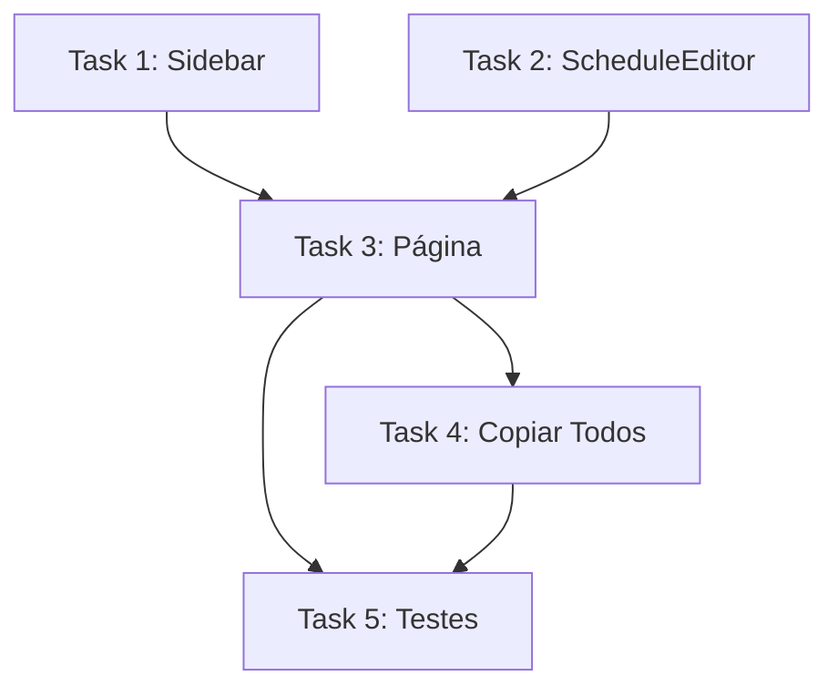

# Feature: Agenda por Funcionário

## Visão Geral
Página dedicada no admin para gerenciar os horários de cada funcionário individualmente, com busca, seleção e edição inline.

## Funcionalidades

### 1. Lista com Busca
- Listar todos os funcionários do salão
- Barra de busca para filtrar por nome
- Indicador de status (ativo/inativo)

### 2. Seleção e Edição Inline
- Ao clicar em "Selecionar", expandir editor de horários abaixo do funcionário
- Toggle "Usar horários do salão" por funcionário
- Grade de 7 dias com checkboxes aberto/fechado e inputs de hora

### 3. Copiar Horários do Salão
- Botão "Copiar para todos" aplica os horários do salão a todos os funcionários

### 4. Salvar Individual
- Cada funcionário salva seus horários independentemente

## Arquivos

| Arquivo | Tipo | Descrição |
|---------|------|-----------|
| `app/dashboard/agenda-profissionais/page.tsx` | Criar | Página principal |
| `components/features/schedule-editor.tsx` | Criar | Componente de edição inline |
| `components/dashboard/sidebar.tsx` | Modificar | Adicionar link "Horários" |
| `lib/actions/profissionais.ts` | Modificar | Adicionar `getAllProfissionaisComHorarios()` |

## UX

```
┌─────────────────────────────────────────────────────────┐
│ Horários da Equipe                                      │
│ ┌─────────────────────────────────┐ [Copiar p/ todos]  │
│ │ 🔍 Buscar profissional...       │                    │
│ └─────────────────────────────────┘                    │
├─────────────────────────────────────────────────────────┤
│ ┌─────────────────────────────────────────────────────┐ │
│ │ 👤 Carlos (Ativo)                        [Selecionar]│ │
│ └─────────────────────────────────────────────────────┘ │
│ ┌─────────────────────────────────────────────────────┐ │
│ │ 👤 Pedro (Ativo)                        [Selecionar]│ │
│ └─────────────────────────────────────────────────────┘ │
├─────────────────────────────────────────────────────────┤
│ (Ao selecionar, expande editor abaixo)                 │
│ Editando: Carlos                                 [Fechar]│
│ ☑ Usar horários do salão                               │
│ Seg: ☑ 09:00 - 19:00                                  │
│ Ter: ☑ 09:00 - 19:00                                  │
│ ...                                                     │
│                                    [Salvar Horários]   │
└─────────────────────────────────────────────────────────┘
```

## Tasks

### Task 1: Adicionar Link "Horários" na Sidebar
**Status:** Pending
**Depends:** Nenhuma

Modificar `components/dashboard/sidebar.tsx`:
- Adicionar item `{ label: "Horários", href: "/dashboard/agenda-profissionais", icon: "schedule" }` no `navItems` após "Agenda"

**Verificação:** Link aparece na sidebar e navega para `/dashboard/agenda-profissionais`

---

### Task 2: Criar Componente ScheduleEditor
**Status:** Pending
**Depends:** Nenhuma

Criar `components/features/schedule-editor.tsx`:

**Interface:**
```tsx
interface ScheduleEditorProps {
  profissional: ProfissionalComHorarios;
  salaoHorarios: Record<string, { aberto: boolean; inicio: string; fim: string }>;
  onClose: () => void;
}
```

**Comportamento:**
- Expandir editor de horários abaixo do profissional selecionado
- Toggle "Usar horários do salão" (padrão: true → herda do salão)
- Grade de 7 dias com checkbox aberto/fechado + inputs `time` para início/fim
- Ao desligar toggle, pré-preenche com horários do salão
- Salvar via `updateProfissionalHorarios()`

**Estados:**
| Estado | Comportamento |
|--------|--------------|
| Loading | Skeleton inline de 3 linhas |
| Toggle ON | Mostra mensagem "Usando horários do salão" |
| Toggle OFF | Mostra grade editável de 7 dias |
| Salvando | Botão desabilitado com spinner |
| Erro | Toast ou mensagem inline de erro |
| Sucesso | Fecha editor, atualiza lista |

**Validação:**
- `inicio` deve ser anterior a `fim`
- Campos `time` desabilitados quando checkbox `aberto` estiver desmarcado
- Se todos os dias estiverem fechados, permitir salvar normalmente

**Verificação:** Editor abre/fecha, toggle funciona, horários salvos persistem

---

### Task 3: Criar Página Principal
**Status:** Pending
**Depends:** Task 1, Task 2

Criar `app/dashboard/agenda-profissionais/page.tsx`:

**Comportamento:**
- `"use client"` — padrão de página com estado
- `useEffect` no mount chama `getAllProfissionaisComHorarios()` e `getSalaoHorariosConfig()`
- Busca por nome (filtro local via `useState` com `toLowerCase`)
- Ao clicar "Selecionar", expande `ScheduleEditor` inline abaixo do card
- Botão "Copiar para todos" (presente no header) aplica horários do salão a todos os profissionais
- Cada profissional salva seus horários independentemente

**Estados:**
| Estado | Comportamento |
|--------|--------------|
| Loading | 3 skeleton cards com `animate-shimmer` |
| Empty (sem profissionais) | `<EmptyState>` com mensagem "Nenhum profissional cadastrado" |
| Empty (busca sem resultados) | Texto "Nenhum profissional encontrado para esta busca" |
| Lista populada | Grid 1 ou 2 colunas com cards |
| Editor expandido | Grade 7 dias visível abaixo do card |
| Copiando todos | Botão desabilitado com spinner, toast ao final |

**UX Flow:**
```
1. Página carrega → lista profissionais + input busca
2. Usuário digita → filtra lista em tempo real
3. Usuário clica "Selecionar" → expande editor inline (único por vez)
4. Usuário ajusta horários → clica "Salvar Horários" → feedback visual
5. Usuário "Copiar p/ todos" → confirma → aplica em lote
```

**Integração com Schema existente:**
- `DIAS_SEMANA` de `@/lib/schemas/salao` já define os dias da semana
- `ProfissionalComHorarios` de `@/lib/actions/profissionais` já tem a estrutura
- `usar_horarios_salao` é inferido: `true` se profissional não tem horários próprios

**Verificação:** Página renderiza, busca filtra, editor salva, cópia em lote funciona

---

### Task 4: Implementar "Copiar para Todos" (Lote)
**Status:** Pending
**Depends:** Task 3

Lógica no `page.tsx`:
- Função `handleCopyAll()`:
  1. Para cada profissional com `usar_horarios_salao === false`
  2. Chama `updateProfissionalHorarios(profissionalId, [])` (limpa horários → herda do salão)
  3. `revalidatePath` e recarrega dados
- Confirmar antes de executar: "Copiar horários do salão para todos os profissionais? Isso substituirá horários personalizados."

**Verificação:** Após executar, nenhum profissional tem horários próprios

---

### Task 5: Testes e Validação
**Status:** Pending
**Depends:** Todas

- Navegar entre páginas via sidebar
- Filtrar profissionais pela busca
- Expandir/recolher editor
- Alternar toggle e editar horários
- Salvar e verificar persistência
- Copiar horários para todos
- Testar com 0, 1 e múltiplos profissionais
- Testar mobile (largura < 1024px)

**Verificação:** Todos os cenários funcionam sem erros no console

---

## Dependências



## Prioridade
Alta - Funcionalidade solicitada pelo usuário
